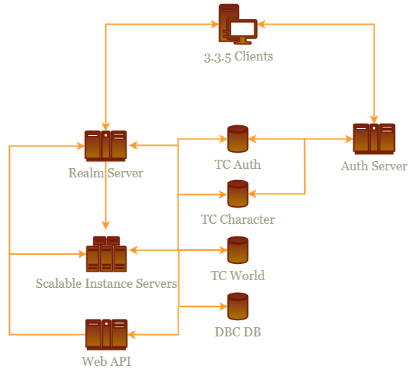

# WrathForgedCore

3.3.5 Emu Server written in C# using modern .NET Technologies and standards. Uses Trinity core Database and AuthServer.

Actively accepts Pull Requests.

## Architecture



### Technologies
- .NET 7.0
- OpenTelemetry
    - Zipkin and OpenTelemetryProtocol supported
- Entity Framework Core
- Serilog
- JSON configuration

## Features
- [X] DBC Database for team focused development
    - [ ] DBCs are exported from the database with a simple command or configured to be exported on startup
- [ ] Instance Servers that are scalable, no need for monolithic servers
    - A note on this, all traffic is still routed through the Realm Server so you want the Instance servers to be on the same network as the Realm Server
- [ ] Web API for server management, and front end UIs such as Account management, armory or wiki.

## Requirements
- .NET 7.0 installed
- [Trinity Core Database](https://trinitycore.info/install/Database-Installation)
- [Trinity Core AuthServer](https://github.com/TrinityCore/TrinityCore/tree/3.3.5)

### Importing Existing DBC
This process is required for entity framework to work with the DBC files. This is a one time process. After all data is manipulated in the database. dbcs can be exported using the realm server command line.
Use your existing DBC files from your TrinityCore installation and import them into the database.

1. Create a new database in your MySQL server called `dbc`
2. Use [WDBX Editor](https://github.com/robinsch/WDBXEditor) to run the following command:

NOTE: change the paths to match your environment
```bash
cd "C:\WoWData\3.3.5 AC\dbc"
for %%F in (*.dbc) do (
    "C:\WoWTools\WDBX.Editor\WDBX Editor.exe" -export -f "C:\WoWData\3.3.5 AC\dbc\%%F" -b 12340 -o "C:\WoWData\3.3.5 AC\sql\%%~nF.sql"
)
```

3. Import the SQL files into your `dbc` database
4. Run the following SQL in this order to perpare the dbc database
    1. https://github.com/ForgedWoW/WrathForgedCore/blob/main/WrathForged.Database/sql/dbc/zzzAllowFK.sql - This allows foreign keys to be created by setting fields to allow null. These fields have default 0 or -1 and dont have valid mappings. in SQL with FK, these need to be null.
    2. https://github.com/ForgedWoW/WrathForgedCore/blob/main/WrathForged.Database/sql/dbc/zzzCleanupInvaiMappings.sql - This cleans up invalid mappings, there is invalid mappings and dead data in 3.3.5 dbc files. these are non existing mappings from over versions.
    3. https://github.com/ForgedWoW/WrathForgedCore/blob/main/WrathForged.Database/sql/dbc/zzzUpdateDefaultValues.sql - fields that have foreign keys and have a default value such as 0 or -1, these need to be null to denote to the foreign key that there is no mapping as the value is default.
    4. https://github.com/ForgedWoW/WrathForgedCore/blob/main/WrathForged.Database/sql/dbc/zzzzAlterTables.sql - Sets the FK on the tables.